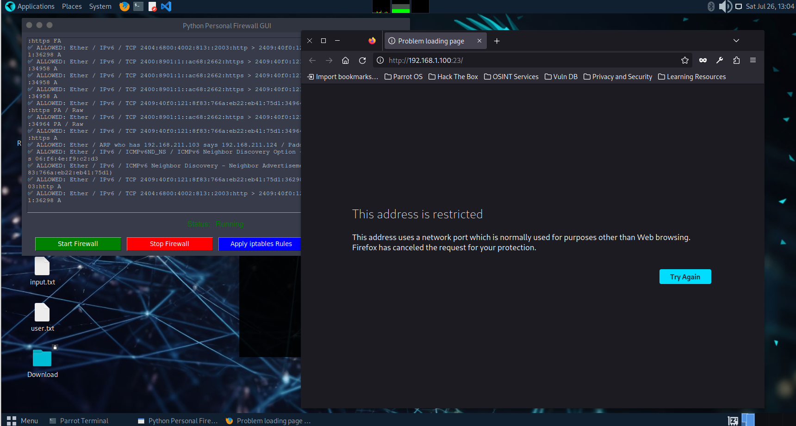

# 🔥 Python Personal Firewall (GUI + iptables)

A lightweight personal firewall built using **Python**, **Scapy**, **Tkinter**, and **iptables**.  
It sniffs packets, blocks traffic based on user-defined rules, and gives real-time control with a GUI.

## 💡 Features

- 🧠 Custom rule-based blocking from `rules.json`
- 📦 Scapy-based packet sniffer (TCP, UDP, ICMP)
- 🛡️ Real-time GUI with Start/Stop buttons
- 🔥 iptables integration to enforce system-level blocks
- 🧾 Logs allowed traffic to `logs/blocked.log`

## 📁 Project Structure

```
personal_firewall/
├── firewall.py # Sniffs and filters packets based on rules
├── firewall_gui.py # GUI to start/stop firewall and manage iptables
├── iptables_blocker.py # CLI-based iptables rule manager
├── rules.json # Custom IP/port/protocol blocking rules
├── logs/
│ └── blocked.log # Logs of blocked/suspicious packets
├── requirements.txt # Required Python libraries
└── Readme.md # Project overview and usage instructions
```

## 🖼️ Screenshot

### Firewall GUI & Blocked Access Demonstration


